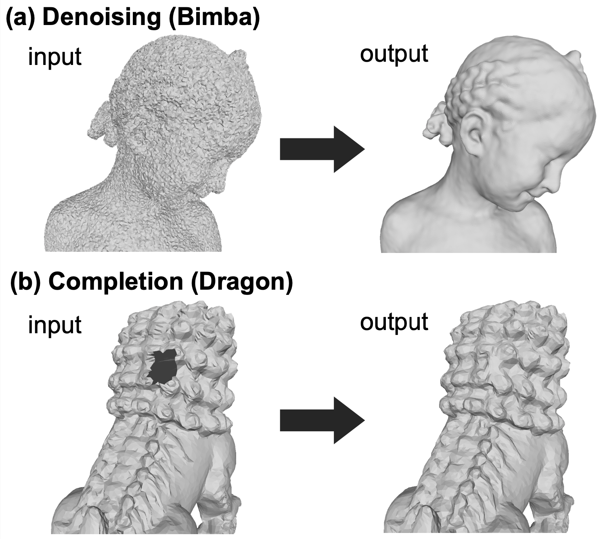

<br><br><br><br><br><br>

# Deep Mesh Prior

Deep Mesh Prior is an unsupervised mesh restoration method using graph convolutional networks, which takes a single incomplete mesh as input data and directly outputs the reconstructed mesh without being trained using large-scale datasets.



# Getting Started

## Installation
```
git clone https://github.com/astaka-pe/DeepMeshPrior.git
cd DeepMeshPrior
conda env create -f environment.yml
conda activate dmp
```

## Mesh Denoising
```
python denoise.py -i datasets/d_input/dragon
```
- To view the loss and MAD, run `tensorboard --logdir logs/denoise` in another terminal and click <http://localhost:6006>.

## Mesh Completion
```
python completion.py -i datasets/c_input/dragon
```
- To view the loss, run `tensorboard --logdir logs/competion` in another terminal and click <http://localhost:6006>.